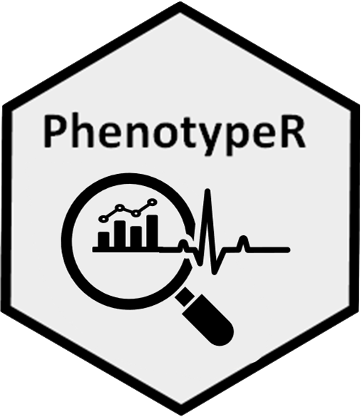

<!-- README.md is generated from README.Rmd. Please edit that file -->

# PhenotypeR 

<!-- badges: start -->

[](https://CRAN.R-project.org/package=PhenotypeR)
[](https://github.com/ohdsi/PhenotypeR/actions/workflows/R-CMD-check.yaml)
[](https://lifecycle.r-lib.org/articles/stages.html#experimental)

<!-- badges: end -->

The PhenotypeR package helps us to assess the research-readiness of a
set of cohorts we have defined. This assessment includes:

- ***Database diagnostics*** which help us to better understand the
  database in which they have been created. This includes information
  about the size of the data, the time period covered, the number of
  people in the data as a whole. More granular information that may
  influence analytic decisions, such as the number of observation
  periods per person, is also described.  
- ***Codelist diagnostics*** which help to answer questions like what
  concepts from our codelist are used in the database? What concepts
  were present led to individuals’ entry in the cohort? Are there any
  concepts being used in the database that we didn’t include in our
  codelist but maybe we should have?  
- ***Cohort diagnostics*** which help to answer questions like how many
  individuals did we include in our cohort and how many were excluded
  because of our inclusion criteria? If we have multiple cohorts, is
  there overlap between them and when do people enter one cohort
  relative to another? What is the incidence of cohort entry and what is
  the prevalence of the cohort in the database? It can also compare our
  study cohorts to the general population by matching people with
  similar age and sex.  
- ***Population diagnostics*** which estimates the frequency of our
  study cohorts in the database in terms of their incidence rates and
  prevalence.

## Installation

You can install PhenotypeR from CRAN:

``` r
install.packages("PhenotypeR")
```

Or you can install the development version from GitHub:

``` r
# install.packages("remotes")
remotes::install_github("OHDSI/PhenotypeR")
```

## Example usage

To illustrate the functionality of PhenotypeR, let’s create a cohort
using the Eunomia Synpuf dataset. We’ll first load the required packages
and create the cdm reference for the data.

``` r
library(dplyr)
library(CohortConstructor)
library(PhenotypeR)
library(CodelistGenerator)
library(duckdb)
library(CDMConnector)
library(DBI)
```

``` r
# Connect to the database and create the cdm object
con <- dbConnect(duckdb(), dbdir = eunomiaDir("synpuf-1k", "5.3"))
cdm <- CDMConnector::cdmFromCon(con = con, 
                                cdmName = "Eunomia Synpuf",
                                cdmSchema   = "main",
                                writeSchema = "main",
                                achillesSchema = "main")
```

Note that we’ve included achilles results in our cdm reference. Where we
can we’ll use these precomputed counts to speed up our analysis.

``` r
cdm
#> 
#> ── # OMOP CDM reference (duckdb) of Eunomia Synpuf ─────────────────────────────
#> • omop tables: person, observation_period, visit_occurrence, visit_detail,
#> condition_occurrence, drug_exposure, procedure_occurrence, device_exposure,
#> measurement, observation, death, note, note_nlp, specimen, fact_relationship,
#> location, care_site, provider, payer_plan_period, cost, drug_era, dose_era,
#> condition_era, metadata, cdm_source, concept, vocabulary, domain,
#> concept_class, concept_relationship, relationship, concept_synonym,
#> concept_ancestor, source_to_concept_map, drug_strength, cohort_definition,
#> attribute_definition
#> • cohort tables: -
#> • achilles tables: achilles_analysis, achilles_results, achilles_results_dist
#> • other tables: -
```

``` r
# Create a code lists
codes <- list("warfarin" = c(1310149L, 40163554L),
              "acetaminophen" = c(1125315L, 1127078L, 1127433L, 40229134L, 40231925L, 40162522L, 19133768L),
              "morphine" = c(1110410L, 35605858L, 40169988L),
              "measurements_cohort" = c(40660437L, 2617206L, 4034850L,  2617239L, 4098179L))

# Instantiate cohorts with CohortConstructor
cdm$my_cohort <- conceptCohort(cdm = cdm,
                               conceptSet = codes, 
                               exit = "event_end_date",
                               overlap = "merge",
                               name = "my_cohort")
```

We can easily run all the analyses explained above (**database
diagnostics**, **codelist diagnostics**, **cohort diagnostics**, and
**population diagnostics**) using `phenotypeDiagnostics()`:

``` r
result <- phenotypeDiagnostics(cdm$my_cohort, survival = TRUE)
```

You can also create a table with the expected results, so you can
compare later with the actual results.

``` r
expectations <- tibble(
  "cohort_name" = c("warfarin", "acetaminophen", "morphine", "measurements_cohort"),
  "estimate" = c("Male percentage", "Survival probability after 5y", "Median age", "Median age"),
  "value" = c("56%", "96%", "57-58", "42-45"),
  "source" = c("A clinician", "A clinician", "A clinician", "A clinician"),
  "diagnostic" = c("cohort_characteristics", "cohort_survival", "cohort_characteristics", "cohort_characteristics") 
)
```

Or alternatively, you can use AI to generate expectations

``` r
library(ellmer)
# Notice that you may need to generate an google gemini API with https://aistudio.google.com/app/apikey and add it to your R environment:
# usethis::edit_r_environ()
# GEMINI_API_KEY = "your API"

chat <- chat("google_gemini")

expectations <- getCohortExpectations(chat = chat, 
                      phenotypes = result)
```

Once we have our results we can quickly view them in an interactive
application. Here we’ll apply a minimum cell count of 10 to our results
and save our shiny app to a temporary directory.

``` r
shinyDiagnostics(result = result, minCellCount = 2, directory = tempdir(), expectations = expectations)
```

See the shiny app generated from the example cohort in
[here](https://dpa-pde-oxford.shinyapps.io/PhenotypeRShiny/).

### More information

To see more details regarding each one of the analyses, please refer to
the package vignettes.
